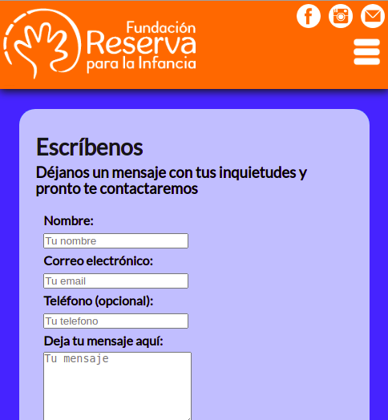
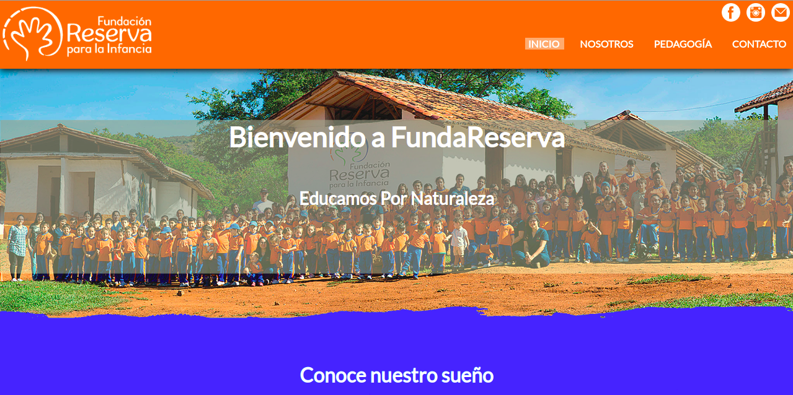

# Project Name: FundaReserva ONG School

This is an informative website for an ONG called Fundación Reserva para la Infancia, located in Barichara-Santander, Colombia.

## Description

This project contains 4 main sections: The index, two informative sections and a Contact section.

It is based on HTML, CSS, Less and Javascript.

## Built With

- Major languages: HTML, CSS & JavaScript.
- Preprocessors: Less.

## Screenshots

Mobile view

 
Large Screen


## Live Demo

[FundaReserva website](http://fundareserva.surge.sh)

# Getting Started 🚀

These instructions will get you a copy of the project up and running on your local machine.

## How To Use 🔧

From your command line, first clone the project:

```bash
# Clone this repository
git clone https://github.com/carlos-osorio-developer/Education-FundaReserva

# Go into the repository
cd Education-FundaReserva

# Open the project on Vscode
code .

```

## Authors

👤 **Carlos Osorio**

- GitHub: [@carlos-osorio-developer](https://github.com/carlos-osorio-developer)
- Twitter: [@OsorioDevelops](hhttps://twitter.com/@OsorioDevelops)
- LinkedIn: [Carlos Osorio](https://www.linkedin.com/in/carlos-osorio-developer/)

## 🤝 Contributing

Contributions, issues, and feature requests are welcome!

Feel free to check the [issues page](./issues/).

## Show your support

Give a ⭐️ if you like this project!

## Acknowledgments

- Thanks to FundaReserva for the years that I spent as a part of this awesome team and beatiful family. I learned so much from this experience.

## 📝 License

This project is [MIT](lic.url) licensed.